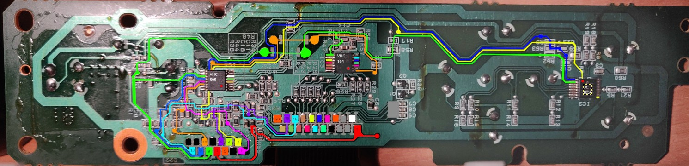
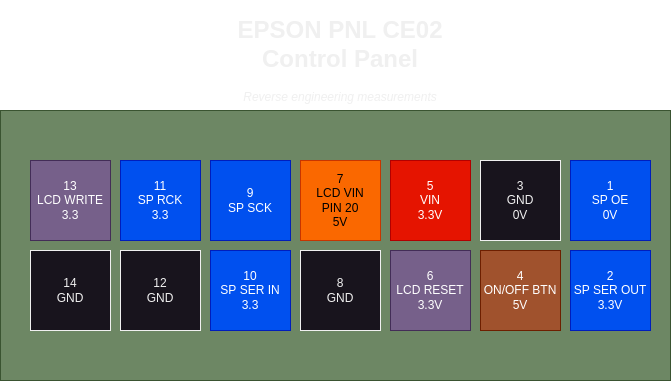

# Reverse engineering of EPSON XP 520/530/540 Control Panel (PNL CE02)

## My knowledge

I was a real newbie in the Arduino world, but I have some technical knowledge from my career as a DevOps engineer.
This project allowed me to (re)learn C++, the Arduino ecosystem, electronics and to build a library and publish it.
After reading a very interesting [article](https://www.nycresistor.com/2022/01/18/repurposing-control-panel/), I decided to give it a try!

## Understanding control panel architecture

After ripping the control panel from the printer, I have disassembled it to discover the control panel board.


In order to understand the architecture, I used GIMP to color the tracks:


We can identify 3 components, from left to right:

 * **VHC595**: Latched shift register, act as an extender writable pins. Only 4 pins are used on his 8 pins extending capability: LCD BACKLIGHT, LCD CS, LCD D/C and LED POWER.
 * **VHC164**: Non-latched shift register, act as a multiplexer to send parallel data to the GIANTPLUS ILI9163C screen
 * **LV165A**: Latched shift register, act as an extender readable pins. All 8 pins are mapped to each buttons, except the power supply which has a dedicated track.

## Identifying display

This was the hard part of this project. The only reference was GIANTPLUS printed on the flex ribbon cable of the screen. After hours of searching, I can't identify this screen.

The deducted information was:
 * the 8-bit parallel interface wired through the VHC164
 * LED backlight on PIN 1 and 2

Right, we have 8/20 pins identified... After long hours searching around the web to see a screen which might corresponding with presumably to this pin assignments, I've discover one on a chinese website, great! However, the picture quality was terribly bad:


After stealing my grandpa's glasses, I was able to map each pins of the screen:


*3, 4, 5 are stabilization pins wired to capacitors*

Now let's try the screen! I've plugged the screen directly to a 20 FPC adapter, executing this tiny program into the Arduino:
``` c++
#include <MCUFRIEND_kbv.h>
MCUFRIEND_kbv tft;
uint16_t ID = tft.readID();
Serial.print(ID, HEX);
```

Output:
``` c++
0x9163
```

GOTCHA! The screen is alive and try to communicate with me! Yes my little buddy, you will be soon delivered, I come to the rescue!

Launching the `graphictest_kbv` sketch from [MCUFRIEND_kbv](https://github.com/prenticedavid/MCUFRIEND_kbv) library, the screen works!


## Let's wired up together

Once the screen pinout was found, the rest of the reverse engineering process was a piece of cake. Here is the final control panel pinout:



I've stuck a little bit on refresh screen which was terribly slow. After some investigations, the Arduino builtin `shiftOut()` seems to be the culprit. Convert this to `SPI.transfer()` was the way to go. Another note is the display is wired in write-only mode on control panel board, just force the display to `0x9163` with MCUFRIEND_kbv library correctly adapted:
``` c++
tft.begin(0x9163);
``` 


I hope this little post will be inspiring for someone, have fun with hacking. See you!